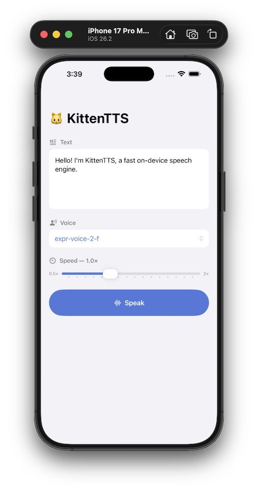

# kittentts-rs

A Rust port of [KittenTTS](https://github.com/KittenML/KittenTTS) — an ultra-lightweight, CPU-only text-to-speech engine based on ONNX models.

## Screenshots

| iOS | Android |
|:---:|:---:|
|  |  |

## Features

- **Zero native deps** — uses [tract-onnx](https://github.com/sonos/tract) (pure Rust) instead of ONNX Runtime
- **Full text preprocessing** — numbers, currencies, abbreviations, ordinals, units, etc. → spoken words
- **espeak-ng phonemisation** — identical IPA output to the Python library
- **Same ONNX models** — works with all KittenTTS HuggingFace checkpoints
- **Automatic chunking** — long texts split into ≤400-char sentence chunks, then concatenated

## Prerequisites

**espeak-ng** must be on `$PATH` for phonemisation:

```sh
# Alpine Linux
apk add espeak-ng

# Debian / Ubuntu
apt install espeak-ng

# macOS
brew install espeak-ng
```

## Installation

### Via crates.io

```sh
cargo add kittentts
```

Or add it manually to your `Cargo.toml`:

```toml
[dependencies]
kittentts = "0.1"
```

### Via GitHub

To use the latest unreleased code directly from the repository:

```sh
# Clone and use as a local path dependency
git clone https://github.com/KittenML/kittentts-rs
```

```toml
[dependencies]
kittentts = { path = "../kittentts-rs" }
```

Or reference it as a git dependency without cloning manually:

```toml
[dependencies]
kittentts = { git = "https://github.com/KittenML/kittentts-rs" }

# Pin to a specific branch or tag
kittentts = { git = "https://github.com/KittenML/kittentts-rs", branch = "main" }
kittentts = { git = "https://github.com/KittenML/kittentts-rs", tag = "v0.1.0" }
```

## Quick Start

Add to `Cargo.toml`:

```toml
[dependencies]
kittentts = "0.1"
```

```rust
use kittentts::download;
use std::path::Path;

fn main() -> anyhow::Result<()> {
    // Downloads model from HuggingFace (cached after first run)
    let tts = download::load_from_hub("KittenML/kitten-tts-mini-0.8")?;

    println!("Available voices: {:?}", tts.available_voices);

    // Generate and save as WAV (24 kHz, float32, mono)
    tts.generate_to_file(
        "Hello from Rust! This high quality TTS model works without a GPU.",
        Path::new("output.wav"),
        "Jasper",
        1.0,   // speed (1.0 = normal)
        true,  // clean_text: run number/abbreviation expansion
    )?;

    Ok(())
}
```

Run the bundled example:
```sh
cargo run --example basic
cargo run --example basic -- --voice Luna --text "Hello world" --output hello.wav
```

## Available Models

| Model | Params | Size |
|---|---|---|
| `KittenML/kitten-tts-mini-0.8` | 80M | 80 MB |
| `KittenML/kitten-tts-micro-0.8` | 40M | 41 MB |
| `KittenML/kitten-tts-nano-0.8-fp32` | 15M | 56 MB |
| `KittenML/kitten-tts-nano-0.8-int8` | 15M | 25 MB |

## Available Voices (v0.8)

`Bella`, `Jasper`, `Luna`, `Bruno`, `Rosie`, `Hugo`, `Kiki`, `Leo`

## API

```rust
// Load from HuggingFace Hub
let tts = kittentts::download::load_from_hub("KittenML/kitten-tts-mini-0.8")?;

// Load from local files (if you already have the ONNX + voices.npz)
let tts = kittentts::model::KittenTtsOnnx::load(
    Path::new("model.onnx"),
    Path::new("voices.npz"),
    std::collections::HashMap::new(), // speed_priors
    std::collections::HashMap::new(), // voice_aliases
)?;

// Generate audio → Vec<f32> at 24 kHz
let audio: Vec<f32> = tts.generate("Hello!", "Jasper", 1.0, true)?;

// Generate and save to WAV
tts.generate_to_file("Hello!", Path::new("out.wav"), "Jasper", 1.0, true)?;

// Available voices
println!("{:?}", tts.available_voices);
```

## Architecture

```
Input text
    ↓  TextPreprocessor  (preprocess.rs)
       • numbers / currency / percentages / ordinals → words
       • contractions, units, scientific notation, fractions, …
    ↓  chunk_text()  (model.rs)
       • split into ≤400-char sentence chunks
    ↓  espeak-ng subprocess  (phonemize.rs)
       • text → IPA phoneme string (en-us, with stress)
    ↓  ipa_to_ids()  (tokenize.rs)
       • IPA chars → integer token IDs  (fixed vocab, same as Python)
       • prepend/append pad token 0
    ↓  tract-onnx inference  (model.rs)
       • inputs:  input_ids [1, T], style [1, D], speed [1]
       • output:  audio waveform [samples]
    ↓  tail-trim (–5 000 samples) + chunk concatenation
    ↓  Vec<f32> @ 24 kHz  or  WAV file
```

## Crate Structure

| File | Role |
|---|---|
| `src/lib.rs` | Public API & re-exports |
| `src/preprocess.rs` | Text preprocessing pipeline (mirrors `preprocess.py`) |
| `src/phonemize.rs` | eSpeak-NG subprocess wrapper |
| `src/tokenize.rs` | IPA character → token ID (mirrors `TextCleaner`) |
| `src/npz.rs` | Hand-written NPY/NPZ loader (no ndarray-npy needed) |
| `src/model.rs` | ONNX inference via tract, chunking, WAV output |
| `src/download.rs` | HuggingFace Hub model download + `config.json` parsing |
| `examples/basic.rs` | CLI example |

## Running Tests

```sh
cargo test                    # unit tests (espeak-ng optional for most)
cargo test -- --include-ignored  # includes the espeak-ng phonemise test
```

## Citation

If you use kittentts-rs in your research or project, please cite:

```bibtex
@software{kittentts_rs_2026,
  author    = {Eugene Hauptmann},
  title     = {kittentts-rs: A Rust Port of KittenTTS},
  year      = {2026},
  url       = {https://github.com/KittenML/kittentts-rs},
  note      = {Ultra-lightweight, CPU-only text-to-speech engine based on ONNX models}
}
```

If you also use the underlying KittenTTS models, please additionally cite the original library:

```bibtex
@software{kittentts_2024,
  author    = {KittenML},
  title     = {KittenTTS},
  year      = {2024},
  url       = {https://github.com/KittenML/KittenTTS}
}
```

## License

This project is licensed under the [Apache License 2.0](LICENSE).
