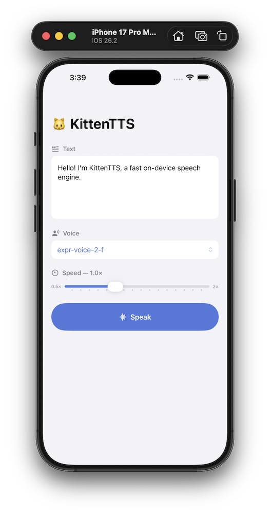
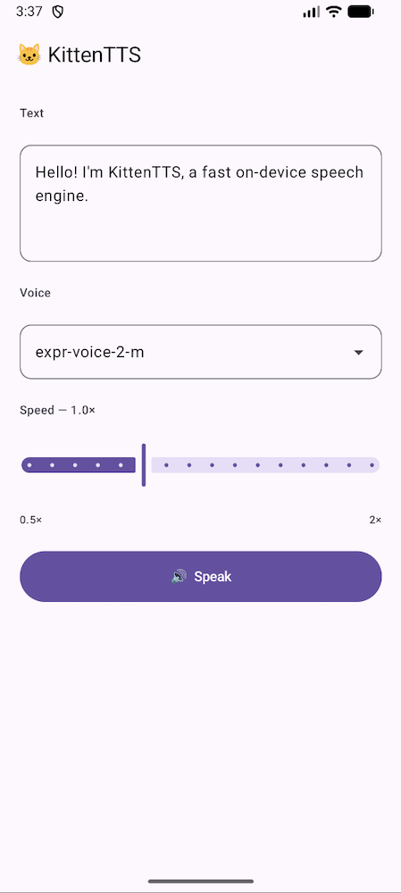

# kittentts-rs

A Rust port of [KittenTTS](https://github.com/KittenML/KittenTTS) — an ultra-lightweight, CPU-only text-to-speech engine based on ONNX models.

## Screenshots

| iOS | Android |
|:---:|:---:|
|  |  |

## Features

- **ONNX Runtime inference** — uses [`ort`](https://github.com/pykeio/ort) (ORT 2.0 bindings) for fast CPU inference
- **Full text preprocessing** — numbers, currencies, abbreviations, ordinals, units, etc. → spoken words
- **espeak-ng phonemisation** — IPA output via the `libespeak-ng` C library (FFI, not subprocess)
- **Same ONNX models** — works with all KittenTTS HuggingFace checkpoints
- **Automatic chunking** — long texts split into ≤ 400-char sentence chunks, then concatenated
- **Cross-platform** — macOS, Linux, Windows (MSVC + MinGW), iOS, Android
- **Cross-compilation** — `cargo cross` supported out-of-the-box for Linux GNU/musl, Android, and more

## Prerequisites

The `espeak` Cargo feature requires **`libespeak-ng`** to be installed (the
shared or static library, **not** just the command-line tool):

```sh
# macOS
brew install espeak-ng

# Debian / Ubuntu (installs libespeak-ng.so + headers)
sudo apt install libespeak-ng-dev

# Alpine Linux (installs libespeak-ng.a for static linking)
apk add espeak-ng-dev espeak-ng-static

# Fedora / RHEL
sudo dnf install espeak-ng-devel

# Arch Linux
sudo pacman -S espeak-ng

# Windows (MSVC) — choose one:
#   Option A: official installer → https://github.com/espeak-ng/espeak-ng/releases
#   Option B: vcpkg
vcpkg install espeak-ng:x64-windows-static
#   Option C: MSYS2/MinGW64
pacman -S mingw-w64-x86_64-espeak-ng
```

The `espeak` feature is **opt-in**. Without it every API that accepts raw IPA
input still works; only text-to-IPA conversion (and therefore the high-level
`generate` / `generate_to_file` functions) is unavailable.

## Installation

```toml
# Cargo.toml

# Without espeak-ng (IPA input only — no native library needed)
[dependencies]
kittentts = "0.2"

# With espeak-ng (full text input)
[dependencies]
kittentts = { version = "0.2", features = ["espeak"] }
```

Or add it with cargo:

```sh
cargo add kittentts
cargo add kittentts --features espeak
```

### From GitHub

```toml
[dependencies]
kittentts = { git = "https://github.com/eugenehp/kittentts-rs", tag = "v0.2.4" }
kittentts = { git = "https://github.com/eugenehp/kittentts-rs", branch = "main" }
```

## Quick Start

```rust
use kittentts::download;
use std::path::Path;

fn main() -> anyhow::Result<()> {
    // Downloads model from HuggingFace (cached after first run)
    let tts = download::load_from_hub("KittenML/kitten-tts-mini-0.8")?;

    println!("Available voices: {:?}", tts.available_voices);

    // Generate and save as WAV (24 kHz, float32, mono)
    tts.generate_to_file(
        "Hello from Rust! This high quality TTS model works without a GPU.",
        Path::new("output.wav"),
        "Jasper",
        1.0,   // speed (1.0 = normal)
        true,  // clean_text: run number/abbreviation expansion
    )?;

    Ok(())
}
```

Run the bundled example:

```sh
cargo run --example basic --features espeak
cargo run --example basic --features espeak -- --voice Luna --text "Hello world" --output hello.wav
```

## Available Models

| Model | Params | Size |
|---|---|---|
| `KittenML/kitten-tts-mini-0.8` | 80M | 80 MB |
| `KittenML/kitten-tts-micro-0.8` | 40M | 41 MB |
| `KittenML/kitten-tts-nano-0.8-fp32` | 15M | 56 MB |
| `KittenML/kitten-tts-nano-0.8-int8` | 15M | 25 MB |

## Available Voices (v0.8)

`Bella`, `Jasper`, `Luna`, `Bruno`, `Rosie`, `Hugo`, `Kiki`, `Leo`

## API

```rust
// Load from HuggingFace Hub
let tts = kittentts::download::load_from_hub("KittenML/kitten-tts-mini-0.8")?;

// Load from local files
let tts = kittentts::model::KittenTtsOnnx::load(
    Path::new("model.onnx"),
    Path::new("voices.npz"),
    Default::default(), // speed_priors
    Default::default(), // voice_aliases
)?;

// Generate audio → Vec<f32> at 24 kHz
let audio: Vec<f32> = tts.generate("Hello!", "Jasper", 1.0, true)?;

// Generate and save to WAV
tts.generate_to_file("Hello!", Path::new("out.wav"), "Jasper", 1.0, true)?;

// Available voices
println!("{:?}", tts.available_voices);
```

## Build Configuration

### Environment Variables

| Variable | Description |
|---|---|
| `ESPEAK_LIB_DIR` | Directory containing `libespeak-ng.a` or `espeak-ng.lib`. Takes priority over all auto-detection. Required for iOS/Android. |
| `ESPEAK_SYSROOT` | Root of a cross-compilation sysroot. All Unix candidate lib paths are prefixed with this value. |
| `ESPEAK_BUILD_SCRIPT` | Path to a script that builds `libespeak-ng` from source. Invoked automatically when `ESPEAK_LIB_DIR` is set but the archive is missing. |
| `ESPEAK_TAG` | espeak-ng release tag used by the build scripts (default: `1.52.0`). |
| `VCPKG_ROOT` | vcpkg installation root; enables vcpkg-installed espeak-ng on Windows. |
| `MSYS2_PATH` | MSYS2 installation root on Windows (default: `C:\msys64`). |
| `ANDROID_NDK_HOME` | Android NDK root for Android cross-compilation (also `ANDROID_NDK_ROOT` / `NDK_HOME`). |
| `PKG_CONFIG_ALLOW_CROSS` | Set to `1` to allow `pkg-config` to run during cross-compilation. |

### Auto-build Script

Point `ESPEAK_BUILD_SCRIPT` at one of the provided scripts to have the build
system compile `libespeak-ng` automatically when the archive is missing:

```sh
# macOS / Linux — any target
ESPEAK_LIB_DIR=$PWD/espeak-static/lib \
ESPEAK_BUILD_SCRIPT=$PWD/scripts/build-espeak-static.sh \
  cargo build --features espeak

# Windows
$env:ESPEAK_LIB_DIR = "$PWD\espeak-static\lib"
$env:ESPEAK_BUILD_SCRIPT = "$PWD\scripts\build-espeak-static.ps1"
cargo build --features espeak
```

## Cross-Compilation

### Linux → Linux aarch64 (Debian/Ubuntu multiarch — simplest)

```sh
sudo dpkg --add-architecture arm64
sudo apt update
sudo apt install gcc-aarch64-linux-gnu libespeak-ng-dev:arm64
rustup target add aarch64-unknown-linux-gnu
cargo build --target aarch64-unknown-linux-gnu --features espeak
```

### Any host → Linux x86_64 or Windows x64 with `cargo-zigbuild`

[`cargo-zigbuild`](https://github.com/rust-cross/cargo-zigbuild) uses the Zig
compiler as a drop-in cross-linker — no Docker, no SDK, no sysroot required
for the default (no-espeak) feature set.

```sh
cargo install cargo-zigbuild
rustup target add x86_64-unknown-linux-gnu x86_64-pc-windows-gnu

# Linux x86_64 — ORT static lib downloaded automatically
cargo zigbuild --target x86_64-unknown-linux-gnu

# Windows x64 — requires llvm-dlltool to generate an ORT import library
#   (one-time setup; replace /path/to/ort with your ORT Windows DLL directory)
ORT_LIB_LOCATION=/path/to/ort \
ORT_PREFER_DYNAMIC_LINK=1 \
  cargo zigbuild --target x86_64-pc-windows-gnu
```

The Windows build produces a `libkittentts.a` containing genuine x86-64 COFF
objects that link against `onnxruntime.dll` at runtime.

### Any host → any target with `cargo cross`

```sh
cargo install cross --git https://github.com/cross-rs/cross

# cross reads Cross.toml and installs libespeak-ng-dev inside the container
cross build --target aarch64-unknown-linux-gnu  --features espeak
cross build --target armv7-unknown-linux-gnueabihf --features espeak
cross build --target x86_64-unknown-linux-musl  --features espeak
cross build --target riscv64gc-unknown-linux-gnu --features espeak
```

`Cross.toml` in the repository root configures `pre-build` commands for every
supported GNU and musl target.  No manual setup beyond installing `cross` is
required.

### Custom sysroot

```sh
ESPEAK_SYSROOT=/path/to/target-sysroot \
  cargo build --target aarch64-unknown-linux-gnu --features espeak
```

### Build espeak-ng from source for a specific target

```sh
# Linux → aarch64 (requires: apt install gcc-aarch64-linux-gnu)
ESPEAK_LIB_DIR=$PWD/espeak-static/aarch64/lib \
ESPEAK_TARGET=aarch64-unknown-linux-gnu \
  bash scripts/build-espeak-static.sh

# Linux → Android arm64 (requires: ANDROID_NDK_HOME set)
ESPEAK_LIB_DIR=$PWD/espeak-static/android/lib \
ESPEAK_TARGET=aarch64-linux-android \
ANDROID_NDK_HOME=/path/to/ndk \
  bash scripts/build-espeak-static.sh

# Windows (MSYS2 or MSVC)
$env:ESPEAK_LIB_DIR = "$PWD\espeak-static\lib"
powershell -ExecutionPolicy Bypass -File scripts\build-espeak-static.ps1
```

### iOS

```sh
bash ios/build_rust_ios.sh
```

Builds espeak-ng for both device (arm64) and Simulator (arm64-sim), compiles
kittentts-rs for each slice, and packages everything into
`ios/KittenTTS.xcframework`.

### Android

```sh
export ANDROID_NDK_HOME=/path/to/ndk
bash android/build_rust_android.sh
```

Builds espeak-ng as a shared library, compiles the Rust static lib and JNI
bridge, and copies all `.so` files into
`android/KittenTTSApp/app/src/main/jniLibs/arm64-v8a/`.

## Architecture

```
Input text
    ↓  TextPreprocessor  (preprocess.rs)
       • numbers / currency / percentages / ordinals → words
       • contractions, units, scientific notation, fractions, …
    ↓  chunk_text()  (model.rs)
       • split into ≤ 400-char sentence chunks
    ↓  libespeak-ng FFI  (phonemize.rs)
       • text → IPA phoneme string (en-us, with stress)
       • requires `espeak` feature + libespeak-ng linked at build time
    ↓  ipa_to_ids()  (tokenize.rs)
       • IPA chars → integer token IDs  (fixed vocab, same as Python)
       • prepend/append pad token 0
    ↓  ONNX Runtime inference  (model.rs)
       • inputs:  input_ids [1, T], style [1, D], speed [1]
       • output:  audio waveform [samples]
    ↓  tail-trim (–5 000 samples) + chunk concatenation
    ↓  Vec<f32> @ 24 kHz  or  WAV file
```

## Crate Structure

| File | Role |
|---|---|
| `src/lib.rs` | Public API & re-exports |
| `src/preprocess.rs` | Text preprocessing pipeline |
| `src/phonemize.rs` | libespeak-ng FFI bindings and initialisation |
| `src/tokenize.rs` | IPA character → token ID |
| `src/npz.rs` | Hand-written NPY/NPZ loader |
| `src/model.rs` | ONNX inference, chunking, WAV output |
| `src/download.rs` | HuggingFace Hub model download |
| `src/ffi.rs` | C FFI layer for iOS/Android |
| `build.rs` | Native library detection and linking (Windows + cross-compilation aware) |
| `tests/integration_tests.rs` | Integration & e2e test suite (40 tests, model-file based) |
| `scripts/build-espeak-static.sh` | Build `libespeak-ng.a` from source (macOS/Linux/Android) |
| `scripts/build-espeak-static.ps1` | Build `espeak-ng.lib`/`libespeak-ng.a` from source (Windows) |
| `Cross.toml` | `cargo cross` configuration for Linux GNU/musl targets |
| `.cargo/config.toml` | Cross-compilation linker settings (`cargo-zigbuild`, Windows, Linux x86_64) |
| `ios/build_rust_ios.sh` | Full iOS XCFramework build (device + simulator) |
| `android/build_rust_android.sh` | Full Android arm64 build (JNI + espeak-ng) |
| `examples/basic.rs` | CLI example |

## Running Tests

```sh
# All unit tests (no native library required — 20 tests)
cargo test

# All unit + espeak-ng phonemisation tests (requires libespeak-ng — 28 tests)
cargo test --features espeak

# Integration and e2e tests using bundled model files (32 tests)
cargo test --test integration_tests

# Integration + espeak + full inference e2e tests (40 tests)
cargo test --test integration_tests --features espeak

# Point at a custom model directory
KITTENTTS_MODEL_DIR=/path/to/models cargo test --test integration_tests

# Check that all code compiles for the host target
cargo check
cargo check --features espeak
```

### Test counts at a glance

| Suite | `--features espeak` | Tests |
|---|:---:|---|
| Unit tests (`src/**`) | no | 20 |
| Unit tests (`src/**`) | yes | 28 |
| Integration tests | no | 32 |
| Integration tests | yes | 40 |
| Doc-tests | — | 4 |

## Citation

```bibtex
@software{kittentts_rs_2026,
  author    = {Eugene Hauptmann},
  title     = {kittentts-rs: A Rust Port of KittenTTS},
  year      = {2026},
  url       = {https://github.com/eugenehp/kittentts-rs},
  note      = {Ultra-lightweight, CPU-only text-to-speech engine based on ONNX models}
}
```

```bibtex
@software{kittentts_2024,
  author    = {KittenML},
  title     = {KittenTTS},
  year      = {2024},
  url       = {https://github.com/eugenehp/KittenTTS}
}
```

## Changelog

See [CHANGELOG.md](CHANGELOG.md) for a full history of releases and changes.

## License

This project is licensed under the [Apache License 2.0](LICENSE).
