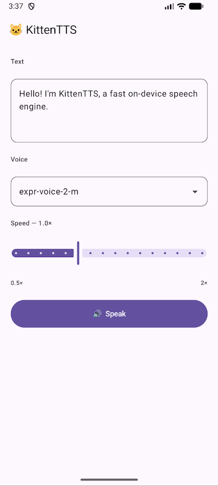

# KittenTTS Android

A Jetpack Compose application that runs the KittenTTS text-to-speech engine
entirely on-device using the Rust library via a JNI bridge.



---

## Prerequisites

| Tool | Version | How to get |
|------|---------|------------|
| Android NDK | **r25 or later** | Android Studio → SDK Manager → SDK Tools → NDK (Side by side) |
| Rust | stable | `curl --proto '=https' --tlsv1.2 -sSf https://sh.rustup.rs \| sh` |
| Rust Android target | — | `rustup target add aarch64-linux-android` |
| CMake | 3.22+ | `brew install cmake` / `apt install cmake` |
| Git, curl, zip, python3 | any recent | standard system tools |

The build script auto-detects the NDK from the standard Android Studio install
path — **no env vars are required** if Android Studio is installed normally:

| OS    | Auto-detected SDK root              |
|-------|-------------------------------------|
| macOS | `~/Library/Android/sdk`             |
| Linux | `~/Android/Sdk`                     |

If detection fails, point the script at your NDK:

```bash
# Option A — NDK version directory directly
export ANDROID_NDK_HOME=~/Library/Android/sdk/ndk/26.3.11579264

# Option B — SDK root; script picks the highest installed NDK version
export ANDROID_HOME=~/Library/Android/sdk
```

---

## Quick start

```bash
# From the repository root:
bash android/build_rust_android.sh
```

Then open **`android/KittenTTSApp`** in Android Studio and press **Run**, or:

```bash
cd android/KittenTTSApp
./gradlew installDebug   # requires a connected device or running emulator
```

---

## What the build script does

| Step | Action |
|------|--------|
| 1 | Cross-compiles **espeak-ng 1.52.0** for `arm64-v8a` using the NDK CMake toolchain → `libespeak-ng.so` |
| 2 | Compiles espeak-ng phoneme tables with a **native host build** (required for `espeak-ng-bin` to run on the build machine) |
| 3 | Downloads **ONNX Runtime 1.23.2** `libonnxruntime.so` from the official Microsoft Maven Central AAR |
| 4 | Cross-compiles **kittentts-rs** as a Rust static library for `aarch64-linux-android` |
| 5 | Compiles `kittentts_jni.c` with NDK Clang and links it against the Rust static lib, `libespeak-ng.so`, and `libonnxruntime.so` → `libkittentts_jni.so` |
| 6 | Copies all four `.so` files into `KittenTTSApp/app/src/main/jniLibs/arm64-v8a/` |
| 7 | Zips the compiled espeak-ng phoneme data into `assets/espeak-ng-data.zip` |
| 8 | Downloads model files from HuggingFace into `assets/models/` |

The script is **incremental**: completed steps are stamp-file-guarded and
skipped on subsequent runs. Only changed components are rebuilt.

---

## Architecture

```
Kotlin (Jetpack Compose)
      │
      │  JNI  (System.loadLibrary)
      ▼
KittenTtsLib.kt  ──────────────►  kittentts_jni.c  (JNI bridge, C)
                                        │
                                        ▼  C API  (kittentts.h)
                                   libkittentts.a  (Rust staticlib)
                                        │
                                        ├── model.rs      (ORT inference)
                                        ├── phonemize.rs  (espeak-ng)
                                        ├── preprocess.rs (text normalisation)
                                        └── tokenize.rs   (IPA → token IDs)
```

### Shared libraries in the APK (`jniLibs/arm64-v8a/`)

| Library | Source | Contents |
|---------|--------|----------|
| `libkittentts_jni.so` | built by script | JNI bridge + Rust staticlib |
| `libonnxruntime.so` | Microsoft Maven Central 1.23.2 | ONNX Runtime |
| `libespeak-ng.so` | built by script from source 1.52.0 | phonemiser |
| `libc++_shared.so` | copied from NDK toolchain | LLVM C++ runtime |

### Load order in `KittenTtsLib.kt`

```kotlin
System.loadLibrary("c++_shared")    // LLVM C++ runtime (ORT depends on it)
System.loadLibrary("onnxruntime")   // ORT
System.loadLibrary("espeak-ng")     // phonemiser
System.loadLibrary("kittentts_jni") // JNI bridge + Rust
```

Loading in dependency order avoids `UnsatisfiedLinkError` on API < 23 and
ensures symbol resolution even on stricter linker configurations.

### Data flow

```
User text
   │
   ▼  TextPreprocessor — numbers/punctuation → words
   │
   ▼  espeak-ng C library → IPA phoneme string
   │
   ▼  ipa_to_ids() → token ID sequence
   │
   ▼  ONNX Runtime session
      inputs:  input_ids  [1, seq_len]  i64
               style      [1, 256]      f32
               speed      [1]           f32
      output:  waveform   [T]           f32
   │
   ▼  write_wav() → 16-bit PCM WAV, mono, 24 kHz
   │
   ▼  MediaPlayer (AudioAttributes: USAGE_MEDIA / CONTENT_TYPE_SPEECH)
   │
   ▼  speaker
```

---

## Runtime behaviour

### First launch
1. **espeak-ng data** — `espeak-ng-data.zip` is extracted from `assets/` into
   `filesDir/espeak-ng-data/`.  A `phontab` sentinel file is checked; if
   present the extraction is skipped on subsequent launches.
2. **Model files** — copied from `assets/models/` (if bundled by the build
   script) or downloaded from HuggingFace on demand.

### Synthesis
`TTSEngine.synthesize()` runs on a `Dispatchers.Default` coroutine, writes the
output to a temporary WAV file in `cacheDir`, then hands the path to
`MediaPlayer`.  Each synthesis call cancels any in-progress playback.

### Audio format
Output is **16-bit signed PCM, mono, 24 kHz**.  This format is universally
supported by Android's `MediaPlayer` across all API levels and the emulator.
(32-bit float WAV is rejected silently by `MediaPlayer` — it accepts the header
but produces no audio output.)

---

## Project structure

```
android/
├── build_rust_android.sh          ← run this first
├── kittentts_jni.c                JNI bridge compiled by the script
├── README.md
└── KittenTTSApp/                  Android Studio project
    ├── settings.gradle.kts
    ├── build.gradle.kts
    ├── gradle/
    │   ├── libs.versions.toml
    │   └── wrapper/gradle-wrapper.properties
    └── app/
        ├── build.gradle.kts
        ├── proguard-rules.pro
        └── src/main/
            ├── AndroidManifest.xml
            ├── jniLibs/arm64-v8a/          ← generated by build script
            │   ├── libkittentts_jni.so
            │   ├── libonnxruntime.so
            │   ├── libespeak-ng.so
            │   └── libc++_shared.so
            ├── assets/                     ← generated by build script
            │   ├── espeak-ng-data.zip
            │   └── models/
            │       ├── kitten_tts_mini_v0_8.onnx
            │       ├── voices.npz
            │       └── config.json
            └── kotlin/com/kittenml/kittentts/
                ├── MainActivity.kt
                ├── KittenTtsLib.kt          JNI declarations
                ├── TTSEngine.kt             ViewModel — model lifecycle & playback
                └── ui/
                    ├── MainScreen.kt        Compose UI
                    └── AudioPlayerBar.kt    Bottom player bar
```

---

## Implementation notes

### Why ORT is linked dynamically (`ORT_PREFER_DYNAMIC_LINK=1`)

`ort-sys` 2.0.0-rc.11 defaults to downloading a **static** `libonnxruntime.a`
from `cdn.pyke.io` and embedding it into the Rust staticlib via
`cargo:rustc-link-lib=static=onnxruntime`.  That archive was compiled against
GCC's libstdc++ (the `__cxx11` ABI), which produces undefined
`_ZTTNSt7__cxx11…` symbols at runtime — symbols that Android's
`libc++_shared.so` (LLVM libc++, `__1` ABI) does not provide.  `dlopen` fails
with "cannot locate symbol".

The fix: set two environment variables during `cargo build`:

```bash
ORT_LIB_LOCATION="${ORT_SHARED_DIR}" \   # directory containing libonnxruntime.so
ORT_PREFER_DYNAMIC_LINK=1 \              # triggers the early-return dylib path
```

From `ort-sys/build/main.rs`:

```rust
if let Some(lib_dir) = vars::get(vars::SYSTEM_LIB_LOCATION) {
    if dynamic_link::prefer_dynamic_linking() {
        println!("cargo:rustc-link-lib=onnxruntime");   // dylib — nothing embedded
        println!("cargo:rustc-link-search=native={}", lib_dir.display());
        return;   // no download, no static embed, no headers needed
    }
}
```

This makes `libkittentts.a` contain only Rust object files with *undefined* ORT
symbol references.  The JNI link step resolves them from Microsoft's official
Maven Central `libonnxruntime.so`, which is compiled with NDK Clang + libc++
and carries no GCC symbols.

### Why `libc++_shared.so` is shipped

`libonnxruntime.so` (Microsoft's build) dynamically links against
`libc++_shared.so`.  Android does not guarantee a system-level `libc++_shared`
in the application's namespace, so the NDK's copy is bundled alongside the
other `.so` files to make the APK self-contained.

### Why WAV output is 16-bit PCM

Android's `MediaPlayer` does not decode IEEE-float (32-bit float) WAV.  It
parses the header successfully (no exception thrown, `duration` is reported
correctly, the progress bar advances) but produces complete silence.  The
Rust `write_wav()` function converts `f32` samples to `i16` with
`(s * i16::MAX as f32).clamp(…) as i16` before writing, producing standard
PCM-16 that every Android API level plays correctly.

---

## Troubleshooting

| Symptom | Likely cause | Fix |
|---------|--------------|-----|
| `UnsatisfiedLinkError` on launch | `.so` files missing from `jniLibs/` | Run `build_rust_android.sh` |
| "Native libraries missing" in app | Same as above | Run `build_rust_android.sh` |
| `cannot locate symbol _ZTTNSt7__cxx11…` | Stale build using wrong ORT | Delete `/tmp/kittentts-android-build/rust-target` and rebuild |
| Model loads but produces silence | Wrong WAV format from old build | Rebuild Rust lib after `write_wav` fix; clear app cache |
| `kittentts_model_load` returns 0 | ORT or espeak-ng init failed | Check logcat tag `KittenTTS_JNI` |
| espeak-ng fails on first launch | `espeak-ng-data.zip` missing or not extracted | Re-run build script; clear app data |
| Gradle sync fails | `jniLibs/` or `assets/` missing | Run `build_rust_android.sh` |
| CMake configure hangs | Stale git repo blocking FetchContent | Script auto-handles via plain-dir sonic workaround |
| NDK not found | Non-standard install path | Set `ANDROID_NDK_HOME` |
| Download times out | Network issue | Retry; model files can be pre-placed in `assets/models/` |

---

## Supported ABIs

The build script targets **`arm64-v8a`** (all 64-bit Android devices since 2014
and the default Android Studio emulator image).

To add `x86_64` (Intel/AMD emulator):

1. Run the script with `RUST_TRIPLE=x86_64-linux-android`.
2. Copy the resulting `.so` files into `jniLibs/x86_64/`.
3. Add `"x86_64"` to `abiFilters` in `app/build.gradle.kts`.

> **Note:** `arm64-v8a` emulator images (Google's "Arm" AVD type in
> Android Studio) run the arm64 libraries natively on Apple Silicon Macs and
> via hardware virtualisation on other hosts — no `x86_64` build is needed
> for emulator testing if you select the right AVD image.
